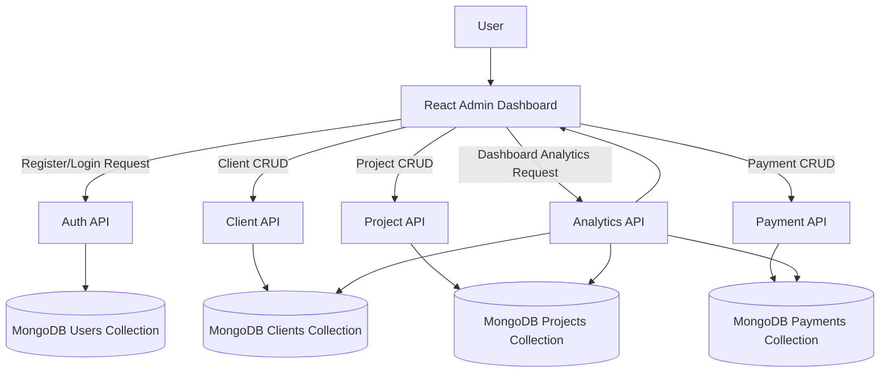
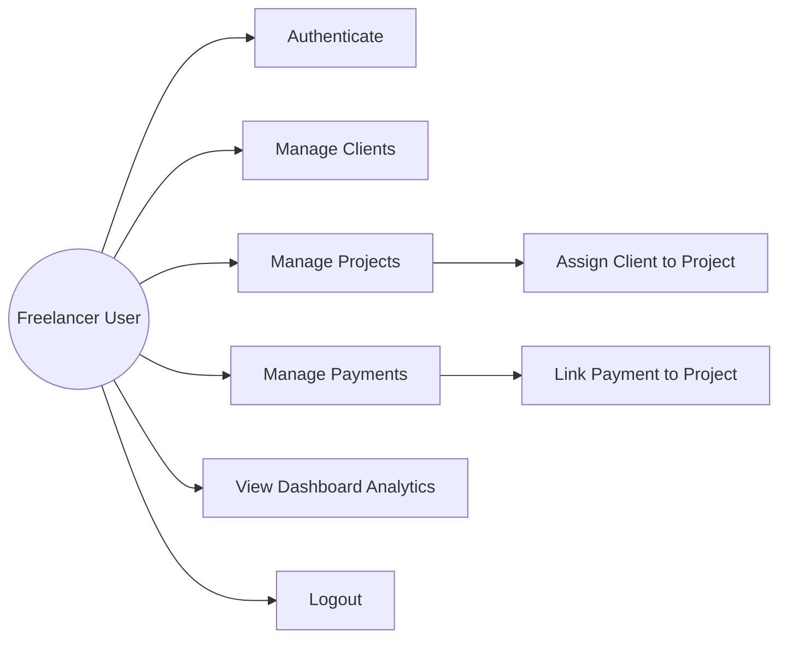
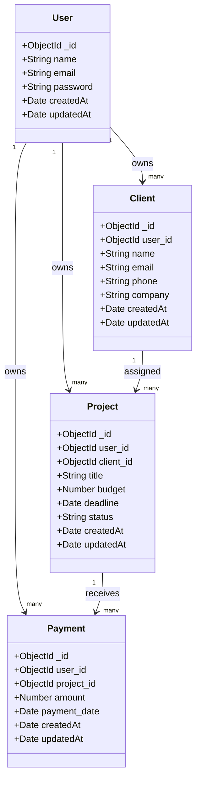
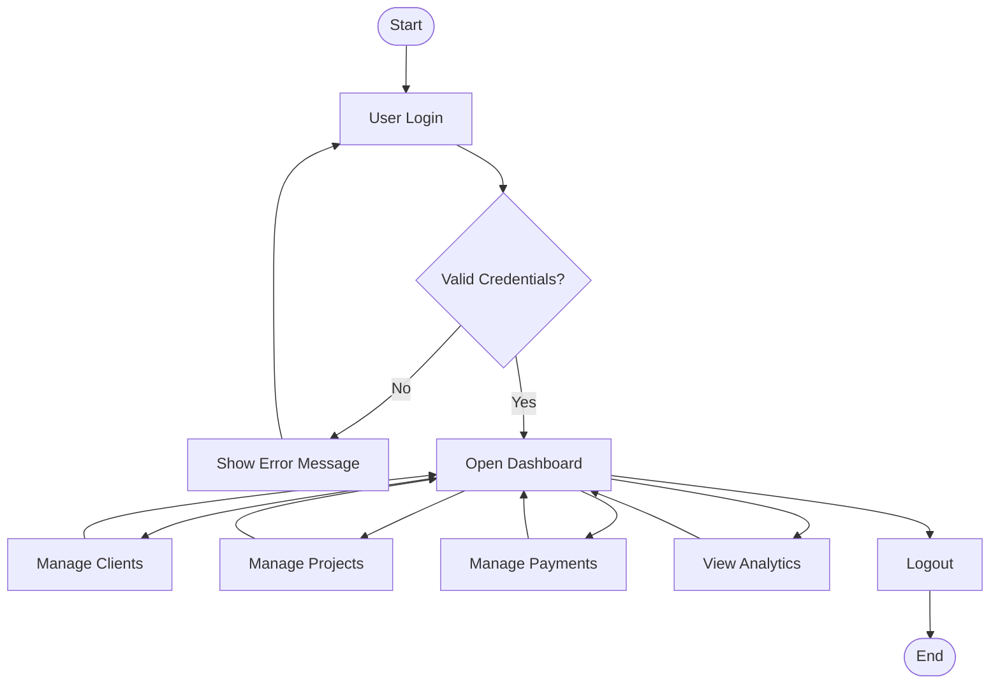
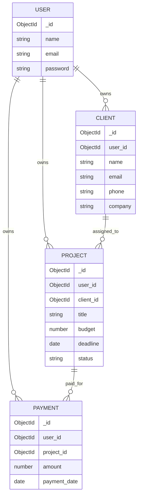
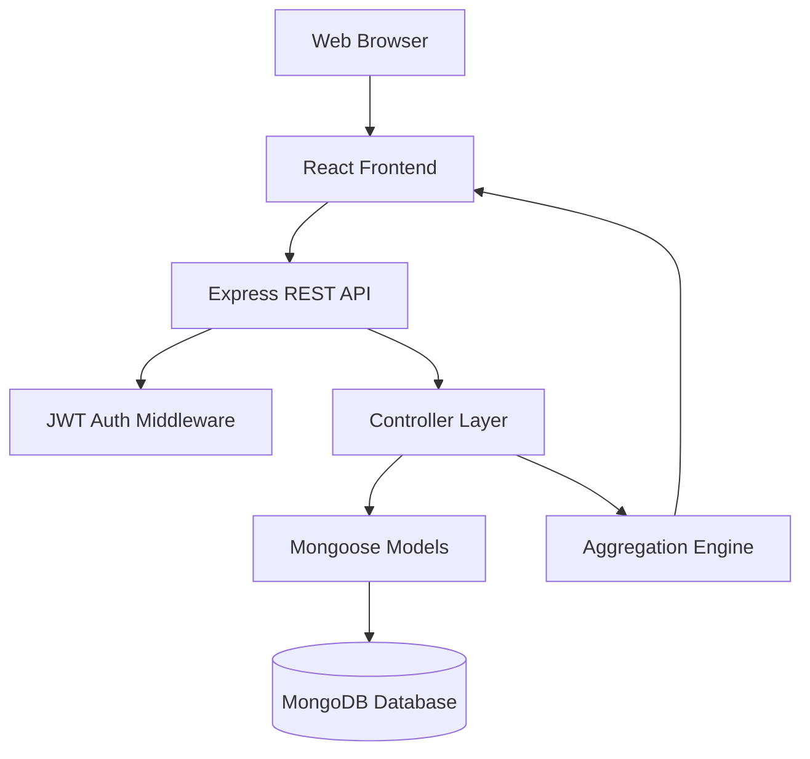

# Abstract

The rapid expansion of freelance work in software, design, content creation, and digital marketing has transformed individual professionals into small service businesses that require structured operational management. However, many freelancers still maintain client records, project timelines, and payment histories through disconnected tools such as spreadsheets, messaging applications, and manual notebooks. This fragmented approach often results in delayed invoicing, poor project visibility, inconsistent follow-up, and limited financial analysis. The present project, *Freelancer Management and Analytics System*, addresses this gap by providing a centralized, secure, and data-driven web-based platform for managing core freelance operations.

The developed system follows the MERN stack architecture, integrating a React-based administrative interface with a Node.js and Express.js backend, while MongoDB is used for persistent, document-oriented data storage. The application includes secure user authentication using JSON Web Tokens and password hashing, role-focused protected routes, and ownership-based data access to ensure that each user can only view and manage personal records. Functional modules include client management, project management, payment tracking, and analytical dashboards. The dashboard aggregates operational and financial data to present key performance indicators such as total earnings, client count, project count, monthly revenue trends, and client-wise earnings distribution.

The implementation approach emphasizes modular design, reusable API communication, structured routing, input validation, and controlled state management at the frontend. In addition to CRUD operations, the system incorporates cross-entity validations, such as linking projects to valid clients and payments to user-owned projects, thereby improving reliability and data consistency. Testing was performed at unit, integration, system, and user acceptance levels to verify functionality, correctness, and usability.

The final outcome is a deployable and extensible application that improves professional workflow efficiency for freelancers by reducing manual overhead, strengthening data security, and enhancing decision-making through analytics. The project demonstrates practical full-stack development capability and provides a strong foundation for future enhancements such as invoicing automation, notification workflows, and predictive financial insights.

# Table of Contents

1. Abstract
2. Table of Contents
3. Chapter 1 – Introduction
4. Chapter 1.1 – Brief Overview of the Project
5. Chapter 1.2 – Purpose and Scope
6. Chapter 1.3 – Background Information
7. Chapter 2 – Problem Definition
8. Chapter 3 – Objectives of the Study
9. Chapter 4 – System Analysis
10. Chapter 4.1 – Existing System
11. Chapter 4.2 – Proposed System
12. Chapter 4.3 – Feasibility Study
13. Chapter 4.4 – Requirement Specification
14. Chapter 5 – System Design
15. Chapter 5.1 – Data Flow Diagram (DFD)
16. Chapter 5.2 – Use Case Diagram
17. Chapter 5.3 – Class Diagram
18. Chapter 5.4 – Activity Diagram
19. Chapter 5.5 – ER Diagram
20. Chapter 5.6 – System Architecture Diagram
21. Chapter 6 – Implementation
22. Chapter 7 – Testing
23. Chapter 8 – Output Screenshots
24. Chapter 9 – Conclusion
25. Chapter 10 – Future Scope
26. Chapter 11 – Bibliography / References
27. Chapter 12 – Appendix

# Chapter 1 – Introduction

## Chapter 1.1 – Brief Overview of the Project

The *Freelancer Management and Analytics System* is a full-stack web application designed to support freelancers in managing their day-to-day business operations through a unified digital platform. Instead of relying on isolated tools for client records, project planning, and payment tracking, the system integrates these functions in a single environment where the user can authenticate, create and maintain data, and monitor business performance through visual analytics. The application is structured as a role-focused admin dashboard where each authenticated user operates within a secure and isolated data context.

From a technical perspective, the system follows a modular architecture with clear separation between presentation, business logic, and data persistence layers. The frontend is built using React.js, enabling component-driven development and route-based navigation across dashboard, client, project, and payment modules. The backend is developed with Node.js and Express.js to expose secure RESTful APIs. MongoDB with Mongoose provides schema-based document storage and supports both transactional data operations and aggregate analytics queries. Security mechanisms include JWT-based session validation, password hashing using bcrypt, and middleware-driven request protection.

The project emphasizes practical utility for small-scale independent professionals. Core features include registration and login, protected route handling, CRUD operations for clients, projects, and payments, relationship mapping across entities, and dashboard analytics for financial and workload insights. The final system is designed not only as an academic implementation but also as a deployable prototype suitable for real-world use by freelancers who need affordable and scalable business management support.

## Chapter 1.2 – Purpose and Scope

The primary purpose of this project is to design and implement a reliable digital system that reduces operational complexity in freelance business management. Freelancers commonly experience administrative burden due to repetitive manual tasks such as storing client details in one place, tracking project status in another, and reconciling payments separately. This project addresses that problem by centralizing major operational workflows into an integrated application where each module contributes to end-to-end process continuity.

The scope of the system includes user authentication, client lifecycle management, project assignment and progress tracking, payment recording, and analytics reporting. Authentication ensures secure onboarding and login for individual users, while protected routes prevent unauthorized access to restricted pages. Client management allows creation, retrieval, update, and deletion of client data. Project management enables assignment of projects to clients, status maintenance, and budget/deadline handling. Payment management links payment entries to corresponding projects to ensure traceability. The dashboard aggregates data from these modules and presents actionable indicators through cards and charts.

The project scope is intentionally focused on the freelancer-admin perspective rather than multi-role enterprise workflows. Features such as invoicing engines, tax filing integration, team-level permissions, and third-party accounting synchronization are identified as future enhancements and are not included in the current implementation. The system is designed for individual use with ownership-aware data rules, ensuring that one user cannot access another user’s records. This scope control allowed concentrated development on correctness, security, usability, and analytics relevance.

The educational scope is equally significant. The project provides full-stack exposure across frontend interface development, backend API design, database schema modeling, middleware-based security, aggregate query processing, and deployment readiness. By implementing complete module integration and testing workflows, the study demonstrates applied software engineering practices within the constraints of a university final-year project environment.

## Chapter 1.3 – Background Information

Freelancing has evolved from informal contract-based assignments to a mainstream professional model supported by global marketplaces and direct client networks. With increasing workload diversity, freelancers now handle multiple concurrent projects, recurring clients, variable payment schedules, and performance expectations similar to small business operations. Historically, freelancers managed these responsibilities manually through notebooks, spreadsheets, and email threads. Although these methods are accessible, they do not scale efficiently as project count and client interactions increase.

Technically, the growth of web technologies has made lightweight business management platforms feasible for independent professionals. The rise of JavaScript-based full-stack ecosystems, especially the MERN stack, has enabled rapid development of responsive dashboards with API-driven data management. MongoDB’s document model is especially suitable for applications where entities such as clients, projects, and payments have flexible yet connected structures. Express.js simplifies service-layer routing and middleware integration, while React.js supports reusable UI components and interactive data views. These advancements provide a strong foundation for building personalized management solutions without enterprise-level infrastructure cost.

At the same time, cybersecurity awareness has become critical even for small systems. User credentials, client contact records, and payment logs are sensitive data points that require secure handling. Modern development standards therefore emphasize password hashing, tokenized authentication, and ownership-bound access control as baseline requirements. In analytics-enabled systems, data aggregation and visual interpretation add strategic value by converting operational records into decision-support insights.

This project is situated at the intersection of these needs: operational centralization, secure digital workflows, and analytics-driven oversight. It reflects both the practical requirements of freelance professionals and the academic objective of implementing an end-to-end information system using contemporary full-stack technologies.

# Chapter 2 – Problem Definition

Freelancers often manage their professional activities without integrated software support, resulting in fragmented records and inconsistent process control. In practical scenarios, a freelancer may store client details in spreadsheets, project timelines in personal notes, and payment status in messaging conversations or bank statements. This unstructured approach introduces multiple operational challenges: duplicate data entry, missed deadlines, delayed follow-up on payments, and poor project visibility.

The first major problem is data fragmentation. When client information, project metadata, and payment records are dispersed across different tools, there is no unified source of truth. A change in one place is rarely synchronized elsewhere, producing outdated records and communication errors. For example, a project may be marked complete in one tracker while payment remains unrecorded, or a client’s updated contact details may not propagate to billing references. Fragmentation also increases cognitive overhead because freelancers spend time searching for information rather than executing work.

The second problem is weak progress and status tracking. Freelancers handling multiple assignments require clear visibility into project states such as pending, in-progress, on-hold, and completed. Without structured status tracking, workload prioritization becomes subjective and deadlines are frequently at risk. In addition, inability to map projects to specific clients creates ambiguity during review meetings and reporting.

The third problem is poor payment traceability and financial analytics. Freelancers need to know which projects generated income, which clients contribute most to earnings, and how revenue varies month-to-month. Manual tracking methods rarely provide these insights in real time. Consequently, financial planning remains reactive rather than strategic.

A fourth challenge is security and data ownership. Informal systems often lack authentication controls, encrypted credential handling, and data access boundaries. If a system stores passwords in plaintext or allows unrestricted record queries, it introduces severe confidentiality and integrity risks. For a professional management platform, secure authentication and ownership-based authorization are mandatory.

These problems clearly justify a technical solution. A centralized web application with secure login, structured CRUD modules, relational validation across entities, and analytics dashboards can directly eliminate fragmentation, improve process control, and support data-driven decisions. Therefore, this project defines the core problem as the absence of an integrated, secure, and analytics-enabled management system tailored for freelance operations.

# Chapter 3 – Objectives of the Study

- **To design a centralized freelancer management platform**
  The system aims to unify client, project, and payment management in one application. This reduces dependency on multiple disconnected tools and improves data consistency.

- **To implement secure user authentication and session control**
  The project includes registration and login with encrypted password storage and token-based access. This objective ensures confidentiality of user data and controlled access to protected modules.

- **To develop complete client management functionality**
  The study targets full CRUD capability for client records with relevant details such as name, contact information, and organization. This objective supports long-term client relationship management.

- **To develop project management with client association**
  Projects are linked to specific clients, enabling traceable ownership and structured progress handling. Status tracking is included to provide visibility into work lifecycle stages.

- **To implement payment tracking linked to projects**
  Each payment entry is mapped to a valid project to ensure financial traceability. This objective helps users monitor incoming revenue and maintain transaction history.

- **To generate dashboard analytics for operational insights**
  The system computes and visualizes key indicators such as total earnings, monthly trends, and client-wise contribution. This objective converts raw records into actionable information.

- **To enforce data ownership and cross-entity validation rules**
  API-level checks ensure that users can only access and modify their own records. Relationship validation prevents invalid references between clients, projects, and payments.

- **To build a responsive and user-friendly admin interface**
  The frontend objective is to provide intuitive workflows with clear navigation, loading/error states, and actionable forms. Improved usability increases productivity and reduces user confusion.

- **To follow modular and maintainable full-stack development practices**
  The implementation follows component-based frontend design and route/controller-based backend structuring. This objective supports future scalability and easier maintenance.

- **To evaluate system reliability through structured testing**
  The project includes unit, integration, system, and acceptance testing. This objective verifies correctness, stability, and readiness for practical deployment.

# Chapter 4 – System Analysis

## Chapter 4.1 – Existing System

In the existing workflow commonly followed by freelancers, operational data is managed manually using isolated tools. Client contact information may be kept in spreadsheet files, project status may be updated in personal notes, and payment records may be inferred from transaction messages or bank statements. This approach is highly dependent on individual discipline and memory, with minimal automation support.

The working method of such a system is mostly linear and non-integrated. When a new project begins, the freelancer creates independent entries across multiple tools. During project execution, status updates are often not synchronized, and when payments are received, reconciliation with project records is performed manually. Report generation for monthly earnings or top clients requires manual computation, which is time-consuming and error-prone.

Several limitations arise from this model. First, data duplication leads to inconsistency and loss of reliability. Second, absence of role-based security increases the risk of exposing sensitive records. Third, no analytical dashboard exists to summarize business performance, which limits strategic planning. Fourth, manual dependency reduces responsiveness when quick decisions are needed.

The risks and inefficiencies include missed deadlines due to incomplete status visibility, delayed payments due to weak follow-up tracking, and poor client service quality due to scattered communication history. Therefore, the existing system can be characterized as low-integration and high-maintenance.

## Chapter 4.2 – Proposed System

The proposed system introduces an integrated web application architecture where all major freelance operations are handled within a unified interface. The workflow begins with secure user authentication. After login, users are redirected to a protected dashboard that summarizes business activity. Dedicated modules allow users to add, edit, delete, and view clients, projects, and payments.

The system workflow is API-driven and state-aware. Frontend actions trigger authenticated requests to backend endpoints. Middleware validates tokens and user context before controller logic is executed. Data is stored in MongoDB collections with schema-driven constraints. For analytics, aggregation pipelines compute totals, monthly trends, client contributions, and project status distributions.

The proposed approach offers several advantages. It reduces data fragmentation by establishing a centralized source of truth. It improves operational reliability through relationship validation and ownership checks. It enhances productivity by minimizing repetitive manual computation and providing immediate access to current records. Security is significantly improved through bcrypt hashing, JWT-based access, and route protection.

Most importantly, the proposed system directly addresses the limitations of the existing process. Instead of reactive and manual management, it enables proactive and structured decision-making.

## Chapter 4.3 – Feasibility Study

### Technical Feasibility

The project is technically feasible because it uses mature, widely supported technologies that are well-suited to full-stack web development. React.js enables modular UI construction and dynamic rendering. Node.js and Express.js offer efficient API development with middleware extensibility. MongoDB supports flexible document storage for entities with evolving attributes.

### Economic Feasibility

The proposed solution is economically feasible for student-level development and small-scale deployment. Core technologies are open-source and do not require licensing cost. Development can be performed using standard personal computing hardware and free development tools.

### Operational Feasibility

Operational feasibility is strong because the system aligns with actual user workflow. Freelancers typically require quick entry forms, searchable records, and simple status tracking interfaces; all are available in the proposed design.

## Chapter 4.4 – Requirement Specification

### Hardware Requirements

| Component | Minimum Specification | Recommended Specification |
|---|---|---|
| Processor | Dual-core CPU | Quad-core CPU |
| RAM | 4 GB | 8 GB or above |
| Storage | 10 GB free space | SSD with 20 GB free space |
| Internet | Basic broadband | Stable high-speed connection |
| Display | 1366×768 resolution | Full HD resolution |

### Software Requirements

| Category | Requirement | Version / Notes |
|---|---|---|
| Operating System | Windows / Linux / macOS | Any modern supported version |
| Runtime | Node.js | 18.x or above |
| Package Manager | npm | 9.x or above |
| Database | MongoDB | 6.x or above |
| Backend Framework | Express.js | 5.x |
| Frontend Library | React.js | 19.x |
| ORM/ODM | Mongoose | 9.x |
| Security Libraries | bcryptjs, jsonwebtoken | Current stable |
| API Client | Axios | Current stable |
| Visualization | Chart.js / React wrapper | Current stable |
| Browser | Chrome / Firefox / Edge | Latest stable |

# Chapter 5 – System Design

## Chapter 5.1 – Data Flow Diagram (DFD)



## Chapter 5.2 – Use Case Diagram



## Chapter 5.3 – Class Diagram



## Chapter 5.4 – Activity Diagram



## Chapter 5.5 – ER Diagram



## Chapter 5.6 – System Architecture Diagram



# Chapter 6 – Implementation

The implementation phase was carried out module-wise to ensure maintainability, traceability, and correctness. The project uses a clear client-server architecture where the frontend handles user interaction and stateful rendering, while the backend provides secure business operations through API endpoints. Database interactions are abstracted via schema models, and each functional module follows a consistent input-process-output pipeline.

The Authentication Module includes user registration, login, protected route access, and logout flow.
Purpose: To secure application entry and prevent unauthorized data access.
Input: User name, email, and password during registration; email and password during login; token for protected API requests.
Process: On registration, backend validates required fields, normalizes email, hashes password with bcrypt, and saves user record. On login, credentials are verified and JWT is generated with expiry metadata. Middleware intercepts protected requests and validates token before forwarding control to route handlers.
Output: Successful registration confirmation, authenticated session token, and secure access to dashboard routes. Logout clears local session data and redirects to login.

The Client Management Module supports CRUD operations over client records.
Purpose: To maintain structured client details in one centralized place.
Input: Client name, email, phone, and company attributes from form submissions.
Process: Frontend forms capture values and call API endpoints. Backend validates ownership using authenticated user context and executes create, read, update, and delete operations through Mongoose queries. List retrieval supports sorted display and interactive search in the UI.
Output: Persistent client records displayed in tabular format with edit and delete controls.

The Project Management Module links projects to clients and tracks status.
Purpose: To monitor work assignments and progress with client mapping.
Input: Project title, selected client ID, budget, deadline, and status.
Process: Before create/update, backend verifies that the selected client belongs to the logged-in user. Project records are stored with relational reference to client. Retrieval queries populate client details for improved readability in the interface. Status values are normalized into meaningful categories used later in analytics.
Output: Structured project records with status indicators and associated client information.

The Payment Management Module links financial transactions to projects.
Purpose: To track earnings and maintain payment history traceability.
Input: Project ID, amount, and payment date.
Process: Backend validates project ownership before writing payment data. Retrieval operations populate project and client references to provide complete context in payment history tables.
Output: Chronological payment records with amount details and source project linkage.

The Dashboard and Analytics Module transforms operational data into insights.
Purpose: To support quick business review and trend-based decision-making.
Input: Authenticated dashboard request from user interface.
Process: Backend executes aggregation pipelines on payments, projects, and clients to compute total earnings, monthly revenue groups, client-wise totals, and project status summaries.
Output: Visual dashboard with key indicators, trend graphs, and distribution charts.

### Technologies Used

- React.js: Used for component-based UI development, route-level navigation, and form-driven interactions.
- Axios: Provides centralized API communication with reusable interceptors for token injection and unauthorized-session handling.
- Node.js + Express.js: Delivers lightweight, scalable API services with middleware support for authentication and validation flow.
- MongoDB + Mongoose: Supports flexible schema modeling and relationship references across user, client, project, and payment entities.
- JWT + bcrypt: Implements secure authentication with encrypted passwords and signed session tokens.
- Chart.js: Enables visual interpretation of aggregated business data through line, pie, and doughnut charts.

### Coding Standards and Development Methodology

The project follows modular coding principles: separate route, controller, middleware, and model layers at backend, and reusable page/component structure at frontend. Naming conventions were kept consistent for endpoints and payloads. Input validation and error handling are explicitly managed to avoid ambiguous failures. API responses use predictable JSON structures for easier frontend integration.

A practical iterative methodology was followed: requirement finalization, model design, API implementation, UI integration, module testing, analytics refinement, and deployment preparation. This approach reduced integration risk and enabled incremental verification at each stage.

# Chapter 7 – Testing

Testing was conducted in multiple stages to ensure that the application is reliable, secure, and functionally complete. The testing strategy includes unit testing of isolated backend functions, integration testing of module interactions, system testing for full workflow validation, and user acceptance testing to confirm practical usability.

Unit Testing targeted individual logic units such as input validation conditions, authentication middleware behavior, and utility transformations.
Integration Testing verified interactions across modules, for example, creating a project after selecting an existing client, and creating a payment linked to a valid project.
System Testing executed complete end-to-end flows from registration to dashboard verification.
User Acceptance Testing involved scenario-based usage that reflects real freelancer behavior, such as adding multiple clients and checking monthly earnings trends.

## Test Cases Table

| Test Case ID | Module | Test Scenario | Input Data | Expected Result | Status |
|---|---|---|---|---|---|
| TC-01 | Authentication | Register new user | Valid name, email, password | User account created successfully | Pass |
| TC-02 | Authentication | Login with valid credentials | Registered email and password | JWT token issued, redirect to dashboard | Pass |
| TC-03 | Security | Access protected route without token | Direct route URL request | Access denied, redirected to login | Pass |
| TC-04 | Client Module | Add new client | Name + optional contact fields | Client appears in client list | Pass |
| TC-05 | Project Module | Add project with valid client | Title, client_id, status | Project created and mapped to client | Pass |
| TC-06 | Payment Module | Add payment with valid project | project_id, amount, date | Payment saved and visible in history | Pass |
| TC-07 | Analytics | View dashboard after payment entries | Existing payment data | Cards/charts show updated aggregates | Pass |
| TC-08 | Validation | Add payment with invalid project | Unknown project_id | Request rejected with validation error | Pass |

## Expected vs Actual Results

| Feature | Expected Result | Actual Result | Observation |
|---|---|---|---|
| Registration | New user should be stored with encrypted password | User created with hashed password | Secure behavior confirmed |
| Login | Valid credentials should return token | Token returned and session stored | Works as intended |
| Protected API Calls | Unauthorized calls should fail | 401 returned; session cleared on frontend | Access control effective |
| Client CRUD | Full create/read/update/delete lifecycle should work | All CRUD actions successful | Stable module behavior |
| Project-Client Linking | Project must reference user-owned client | Invalid references rejected | Cross-entity validation works |
| Payment-Project Linking | Payment must reference user-owned project | Invalid references rejected | Financial traceability preserved |
| Dashboard Analytics | Aggregated values should match database records | Chart values matched seeded and live data | Aggregation correctness verified |
| Logout | Session must be invalidated on client side | Local auth data cleared and route redirected | Session control functional |

# Chapter 8 – Output Screenshots

## Screenshot 1: Login Page

Description: Displays email and password input fields, authentication button, and navigation link to registration.
Purpose: Demonstrates secure entry point for authorized users.


## Screenshot 2: Registration Page

Description: Shows user onboarding form with name, email, and password fields.
Purpose: Verifies account creation flow for new users.


## Screenshot 3: Dashboard Overview

Description: Includes statistics cards and analytics charts for earnings, clients, and projects.
Purpose: Shows centralized business insight and decision-support interface.


## Screenshot 4: Client Management Module

Description: Displays searchable client table with add/edit/delete controls.
Purpose: Confirms CRUD implementation for client records.


## Screenshot 5: Project Management Module

Description: Shows project list with linked client, budget, deadline, and status badges.
Purpose: Demonstrates project lifecycle and client assignment tracking.


## Screenshot 6: Payment Management Module

Description: Displays payment history with project mapping and total amount summary.
Purpose: Confirms financial record handling and project-wise traceability.


## Screenshot 7: Add Project Modal/Form

Description: Form interface for creating a project with mandatory client selection.
Purpose: Validates input workflow and relational data entry.


## Screenshot 8: Analytics Breakdown View

Description: Extended chart view showing monthly trend and client contribution distribution.
Purpose: Demonstrates the analytical capability of the system.


# Chapter 9 – Conclusion

The Freelancer Management and Analytics System successfully fulfills the primary objective of providing an integrated, secure, and user-friendly platform for managing freelance operations. The project combines authentication, operational CRUD modules, relational validations, and dashboard analytics in a single full-stack environment. By centralizing client records, project status data, and payment history, the system reduces administrative fragmentation and improves day-to-day workflow efficiency.

From a technical standpoint, the project demonstrates effective use of the MERN stack for practical software engineering outcomes. React-based interface design supports modular and responsive workflows, while Express-based APIs provide organized backend service handling. MongoDB and Mongoose are used effectively for schema-driven data storage and entity relationships. Security implementation through bcrypt and JWT ensures safer credential handling and protected data access.

The analytics component adds significant value by converting operational records into meaningful insights. Instead of manually calculating monthly earnings or identifying high-value clients, users can view real-time summaries and visual trends through dashboard charts. This capability moves the system beyond simple record keeping and enables informed planning and performance tracking.

The project also offered important learning outcomes for full-stack development practice. Key competencies developed include API architecture, middleware design, schema modeling, frontend state handling, route protection, and deployment preparation.

Despite these achievements, some limitations remain. The current system is single-user oriented and does not implement advanced role hierarchies, invoice generation, tax computation, or automated reminders. Reporting exports and offline-first capabilities are also not part of the current version. However, these limitations are deliberate scope controls rather than design weaknesses.

# Chapter 10 – Future Scope

The developed system provides a strong baseline for freelance business management; however, several enhancements can significantly increase practical value and scalability. A major future enhancement is automated invoicing and billing workflows. The platform can be extended to generate professional invoice documents in PDF format based on project milestones and payment records.

A second enhancement area is notification and reminder automation. Scheduled notifications can be integrated for project deadlines, pending payments, and follow-up activities.

Another important direction is multi-role and team collaboration support. While the current system focuses on individual freelancer use, future versions may include role-based modules for managers, accountants, or collaborators.

The analytics engine can be upgraded to include predictive and comparative intelligence. Machine learning-assisted forecasting can estimate future earnings based on historical trends, client behavior, and project completion cycles.

Future versions can also include integration with external ecosystems, such as payment gateways, calendar platforms, accounting tools, and cloud storage systems.

From an engineering perspective, scalability can be improved through pagination, caching, centralized logging, and containerized deployment pipelines. Security can be further enhanced with refresh token rotation, device/session management, and optional two-factor authentication.

Overall, the system has substantial expansion potential and can evolve from a freelancer-focused dashboard into a complete micro-business operations platform.

# Chapter 11 – Bibliography / References

[1] M. Welling and M. Thomson, *Node.js in Action*, 2nd ed. Shelter Island, NY, USA: Manning Publications, 2017.

[2] A. Banks and E. Porcello, *Learning React: Functional Web Development with React and Redux*, 2nd ed. Sebastopol, CA, USA: O’Reilly Media, 2020.

[3] V. Burzo, *Full-Stack React Projects*, Birmingham, U.K.: Packt Publishing, 2018.

[4] MongoDB Inc., "MongoDB Manual," 2025. [Online]. Available: https://www.mongodb.com/docs/. [Accessed: Apr. 4, 2026].

[5] Express.js, "Express Web Framework (Node.js)," 2025. [Online]. Available: https://expressjs.com/. [Accessed: Apr. 4, 2026].

[6] Auth0, "JSON Web Token Introduction," 2025. [Online]. Available: https://jwt.io/introduction. [Accessed: Apr. 4, 2026].

[7] O. Khiyam and S. Choi, "Web application authentication security: A practical review," *International Journal of Computer Applications*, vol. 183, no. 12, pp. 15–24, 2021.

[8] Chart.js Contributors, "Chart.js Documentation," 2025. [Online]. Available: https://www.chartjs.org/docs/. [Accessed: Apr. 4, 2026].

# Chapter 12 – Appendix

## A. Sample Configuration Template (Backend)

```text
PORT=5000
MONGODB_URI=mongodb://127.0.0.1:27017/freelancer_db
JWT_SECRET=<replace_with_secure_random_secret>
JWT_EXPIRES_IN=7d
CLIENT_URL=http://localhost:3000
```

## B. Sample Configuration Template (Frontend)

```text
REACT_APP_API_BASE_URL=http://localhost:5000/api
```

## C. Sample Data Records

### Sample Client

```text
name: "Apex Digital Solutions"
email: "contact@apex.example"
phone: "+91-98XXXXXX10"
company: "Apex Digital"
```

### Sample Project

```text
title: "Corporate Portfolio Redesign"
client_id: "<valid_client_object_id>"
budget: 50000
deadline: "2026-06-15"
status: "In Progress"
```

### Sample Payment

```text
project_id: "<valid_project_object_id>"
amount: 15000
payment_date: "2026-04-01"
```

## D. Assumptions and Constraints

1. The system assumes each account represents an independent freelancer and follows user-level data isolation.
2. Internet access is required for deployment usage; local development can operate with localhost configuration.
3. The present version does not include invoice PDF generation, tax computation, or payment gateway integration.
4. Authentication is token-based and assumes secure storage and transport practices in deployment.
5. Dataset size in the current academic scope is moderate; large-scale optimization is reserved for future upgrades.

## E. Deployment Notes

1. Build pipeline compiles the frontend and serves static files through backend routing in production mode.
2. Environment variables must be configured on hosting platform dashboards before first launch.
3. JWT secret rotation is mandatory when moving from local testing to public deployment.
4. Post-deployment smoke tests should include registration, login, CRUD operations, and dashboard analytics validation.
