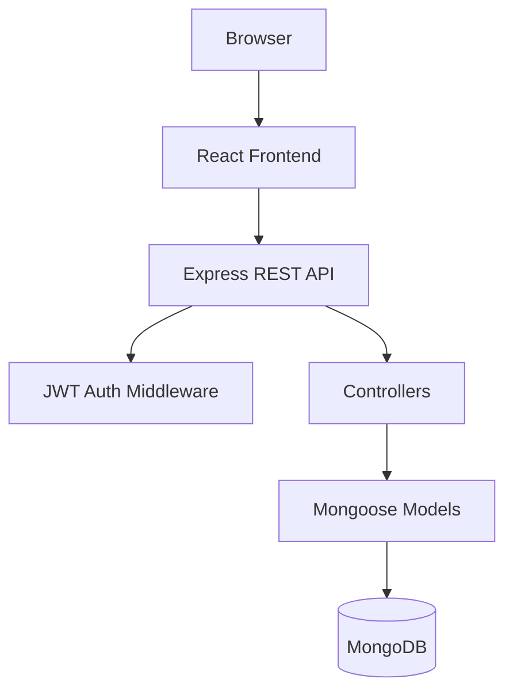

 Freelancer Management and Analytics System

A full-stack MERN web application for freelancers to manage clients, projects, and payments with a secure authentication flow and analytics dashboard.

## Overview

Freelancers often track work using disconnected spreadsheets, chat messages, and notes. This project centralizes operations into one platform so users can:

- Register and log in securely
- Manage client records
- Manage projects and track status
- Record project-linked payments
- View real-time business analytics in a dashboard

The system is built with a React frontend, an Express API backend, and MongoDB for data persistence.

## Key Features

### Authentication and Security

- User registration and login
- Password hashing with bcrypt
- JWT-based protected APIs
- Protected frontend routes
- Automatic session cleanup on unauthorized API responses
- Ownership-based data access checks

### Client Management

- Add new clients
- View searchable client list
- Edit client details
- Delete clients

### Project Management

- Add projects
- Assign a client to each project
- Track project status (Pending, In Progress, On Hold, Completed)
- Edit and delete projects

### Payment Management

- Add payments linked to projects
- View payment history
- Edit and delete payment records
- Track payment totals

### Analytics Dashboard

- Total earnings
- Total clients
- Total projects
- Monthly earnings trend chart
- Client-wise earnings chart
- Project status overview chart
- Loading and error states

## Tech Stack

### Frontend

- React.js
- React Router
- Axios
- Chart.js with react-chartjs-2
- React Icons

### Backend

- Node.js
- Express.js
- Mongoose
- bcryptjs
- jsonwebtoken
- dotenv

### Database

- MongoDB

## Project Structure

```text
asadproject/
  config/
    db.js
  controllers/
    testController.js
  middleware/
    authMiddleware.js
  models/
    User.js
    Client.js
    Project.js
    Payment.js
  routes/
    testRoute.js
  frontend/
    public/
    src/
      App.js
      Dashboard.js
      Clients.js
      Projects.js
      Payments.js
      Login.js
      Register.js
      Layout.js
      ProtectedRoute.js
      api.js
  index.js
  package.json
  DEPLOYMENT_GUIDE.md
  PROJECT_REPORT.md
```

## Architecture



## Getting Started

### Prerequisites

- Node.js 18+
- npm 9+
- MongoDB instance (local or cloud)

### 1. Clone the repository

```bash
git clone https://github.com/<your-username>/<your-repo>.git
cd <your-repo>
```

### 2. Configure environment variables

Create backend env file:

```bash
copy .env.example .env
```

Set values in .env:

- PORT
- MONGODB_URI
- JWT_SECRET
- JWT_EXPIRES_IN
- CLIENT_URL

Optional frontend env for local development:

```bash
copy frontend/.env.example frontend/.env.development
```

### 3. Install dependencies

```bash
npm install
npm install --prefix frontend
```

### 4. Run in development

Start backend:

```bash
npm run dev
```

Start frontend in a new terminal:

```bash
npm start --prefix frontend
```

Frontend: http://localhost:3000
Backend API: http://localhost:5000/api

### 5. Production-style local run

Build frontend and run backend server that serves the build:

```bash
npm run build
npm start
```

App: http://localhost:5000

## API Overview

Base URL: /api

### Public

- POST /register
- POST /login

### Protected (JWT required)

#### Clients

- GET /clients
- GET /clients/:id
- POST /clients
- PUT /clients/:id
- DELETE /clients/:id

#### Projects

- GET /projects
- GET /projects/:id
- POST /projects
- PUT /projects/:id
- DELETE /projects/:id

#### Payments

- GET /payments
- GET /payments/:id
- POST /payments
- PUT /payments/:id
- DELETE /payments/:id

#### Analytics

- GET /dashboard
- GET /analytics/total
- GET /analytics/monthly
- GET /analytics/client-wise
- GET /analytics/project-status

## Security Notes

- Passwords are hashed before storage
- JWT middleware protects private routes
- API queries enforce user-level data ownership
- Cross-entity checks validate references (client-project-payment relationships)

## Deployment

Use the complete deployment steps in DEPLOYMENT_GUIDE.md.

Quick summary:

1. Set production environment variables
2. Run npm run build
3. Start with npm start
4. Deploy on Render or Railway using root project directory

## Screenshots

Add your screenshots here after deployment and final UI polish:

- Login Page
- Dashboard
- Clients Module
- Projects Module
- Payments Module

## Future Enhancements

- Invoice generation (PDF)
- Email and deadline reminders
- Role-based access control
- Export reports (CSV/PDF)
- Advanced analytics and forecasting

## Contributing

Contributions are welcome.

1. Fork the repository
2. Create a feature branch
3. Commit your changes
4. Open a pull request

## License

This project is for academic and educational use. You can add an explicit open-source license (such as MIT) if you plan public reuse.
